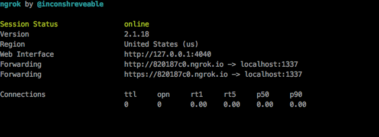

#Twilio Starter Package

##Set up

1. Download this package
2. Make an account on Twilio 
3. Replace the Account Sid and AuthToken with your respective keys 
4. Authenticate your personal number on Twilio
5. Replace the TO and FROM numbers with your personal number and (free) Twilio number respectively  
6. Move ngrok to $PATH with command `mv ngrok /usr/local/bin` (You will only do this once, you'll be able to run ngrok anywhere on your computer) 
7. Run `npm install` then run your node server via `node app.js` 
9. Also run `ngrok http 1337`

###Preface
- The node server runs locally on port 1337, ngrok just gives you a public interface for external apps to use and communicate with.

## How to use

- You can now access your server locally by going to `localhost:1337`
- Or you can access the server from a public server via `http://820187c0.ngrok.io` as per my screenshot below (it will be different for you) 

- Access `localhost:1337/pizzatext` to send yourself a simple pizza text
- Access `localhost:1337/pizzacall` to receive a demo call =)

##TODO
- Easy way to upload xml file to change calling script
- Integrate calling feature with texting to develop a complex app 